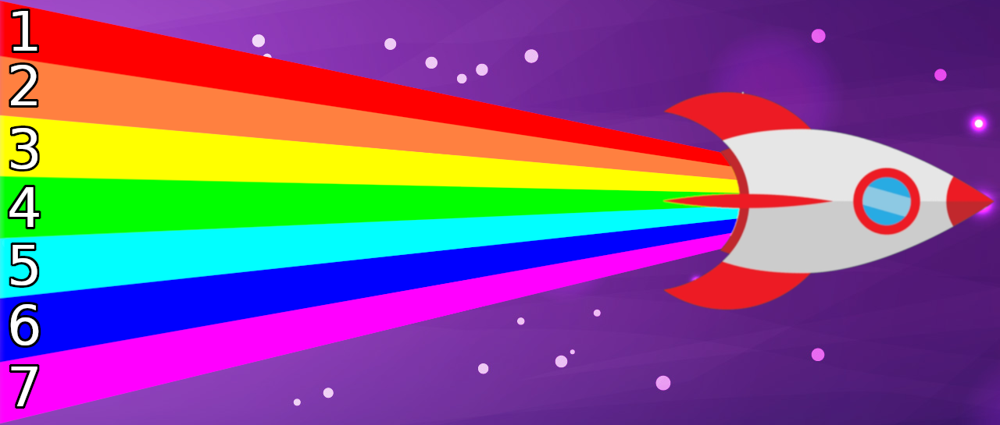
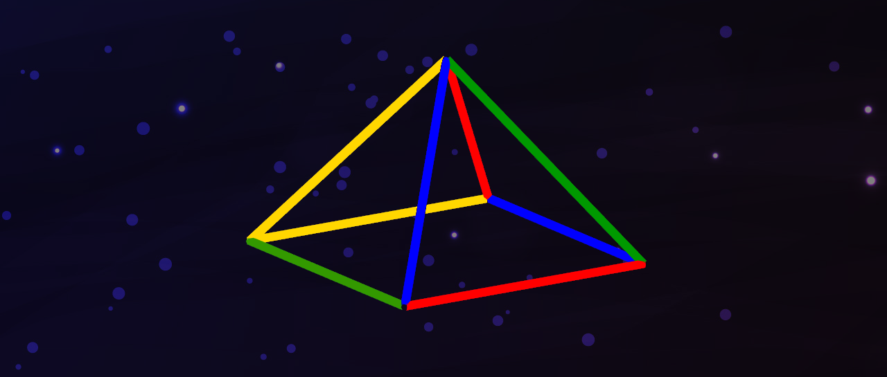
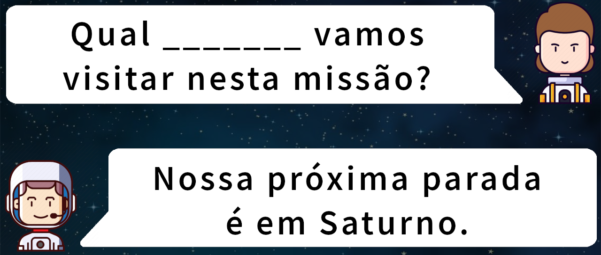
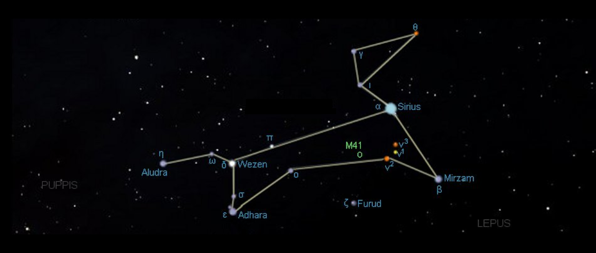
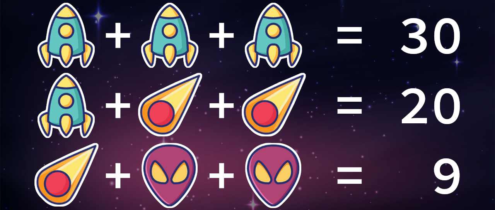
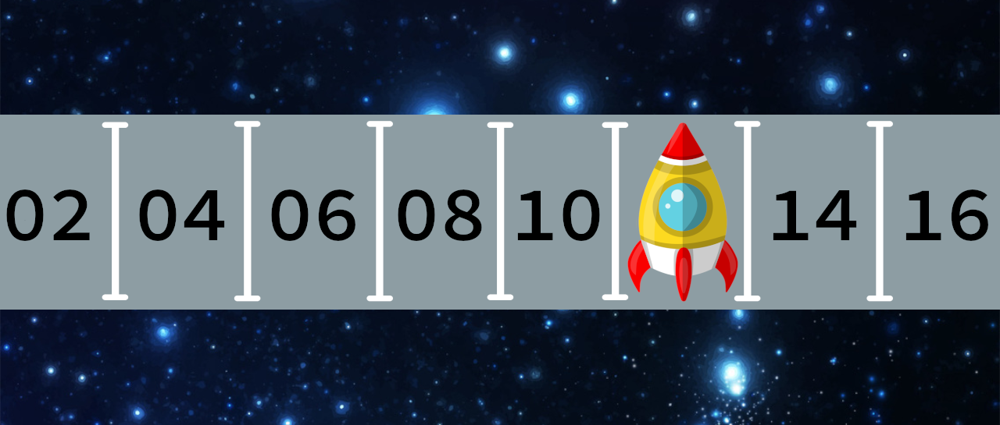
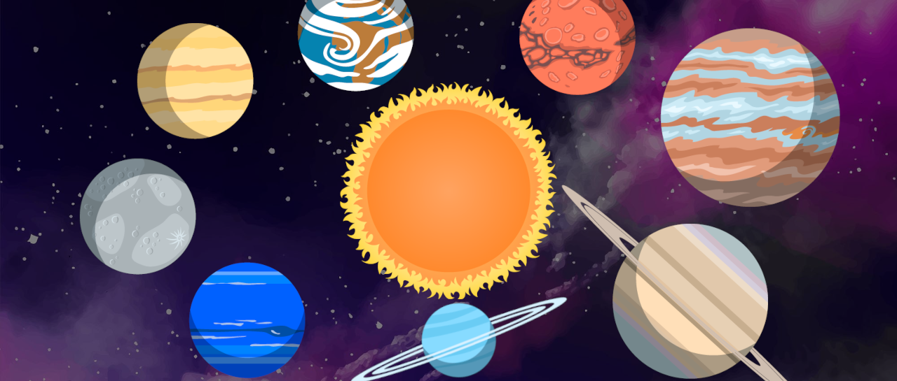

# DESAFIOS DA PÁGINA

- Esse arquivo descreve em detalhes os 10 desafios.

- Cada desafio possui 4 variações. Portanto existem 4 opções de perguntas com 1 resposta certa pra cada.

- As perguntas podem vir na forma de imagem ("desafio_01/01.png", por exemplo) ou um simples texto, assim como as alternativas de resposta, dependendo do objetivo do desafio.

---

# DESAFIO 01 (NÍVEL FÁCIL)

## Título
Combinação de cores

## Descrição
São apresentadas as 7 cores do arco-íris, numeradas de 1 a 7. O objetivo é dizer qual a cor resultante da combinação das cores representadas por dois números

## Opções de perguntas e alternativas de respostas

1. **Qual a cor da mistura entre 1 e 3?**  
Resposta: Laranja

2. **Qual a cor da mistura entre 3 e 6?**  
Resposta: Verde

3. **Qual a cor da mistura entre 1 e 6?**  
Resposta: Roxo

4. **Qual a cor da mistura entre todas as 7 cores?**  
Resposta: Branco

---

# DESAFIO 02 (NÍVEL FÁCIL)

## Título
Pirâmide colorida

## Descrição
É mostrada uma pirâmide com arestas coloridas. O objetivo é achar a forma correta da pirâmide vista de cima.

## Opções de perguntas e alternativas de respostas
1. **Como é esta pirâmide vista de cima?** "desafio_02/pergunta_1.png"  
Resposta: "desafio_02/resposta_1.png"

2. **Como é esta pirâmide vista de cima?** "desafio_02/pergunta_2.png"  
Resposta: "desafio_02/resposta_2.png"

3. **Como é esta pirâmide vista de cima?** "desafio_02/pergunta_3.png"  
Resposta: "desafio_02/resposta_3.png"

4. **Como é esta pirâmide vista de cima?** "desafio_02/pergunta_4.png"  
Resposta: "desafio_02/resposta_4.png"

---

# DESAFIO 03 (NÍVEL FÁCIL)

## Título
Complete a mensagem

## Descrição
O usuário deve preencher o vazio da frase com a palavra correta.

## Opções de perguntas e alternativas de respostas
1. **Complete o diálogo:** Qual _____ vamos visitar nesta missão? Nossa próxima parada é em Saturno.  
Resposta: planeta

2. **Complete o diálogo:** Vamos iniciar o procedimento de pouso. _____!  
Resposta: entendido 

3. **Complete o diálogo:** Estamos saindo da Via Láctea. Nunca estive fora da nossa _____!  
Resposta: galáxia

4. **Complete o diálogo:** Iniciando _____ regressiva. 10, 9, 8, 7, 6, 5, 4, 3, 2, 1.  
Resposta: contagem

---

# DESAFIO 04 (NÍVEL MÉDIO)

## Título
Objetos semelhantes

## Descrição
Dentre as quatro caixas de objetos, qual não pertence ao grupo? Cada variação possui três caixas TRUE que pertencem (martelo, chave de fenda e alicate) e quatro caixas FALSE que não pertencem (rato, dna, prancheta, seringa). São apresentados três caixas TRUE e uma FALSE, e o usuário deve indicar a FALSE.

## Opções de perguntas e alternativas de respostas
1. **Qual caixa não pertence ao grupo?** [Martelo, Rato, Chave de Fenda, Alicate]  
Resposta: Rato

2. **Qual caixa não pertence ao grupo?** [Alicate, Martelo, DNA, Chave de Fenda]  
Resposta: DNA

3. **Qual caixa não pertence ao grupo?** [Prancheta, Chave de Fenda, Martelo, Alicate]  
Resposta: Prancheta

4. **Qual caixa não pertence ao grupo?** [Chave de Fenda, Alicate, Martelo, Seringa]  
Resposta: Seringa

---

# DESAFIO 05 (NÍVEL MÉDIO)

## Título
Constelações

## Descrição
É mostrada uma constelação famosa. Deve-se indicar qual o nome dela, baseado no seu formato.

## Opções de perguntas e alternativas de respostas
1. **Qual o nome da constelação? Dica: observe o formato.** "desafio_05/canismajor.png"  
Resposta: Cão Maior

2. **Qual o nome da constelação? Dica: observe o formato.** "desafio_05/scorpio.png"  
Resposta: Escorpião

3. **Qual o nome da constelação? Dica: observe o formato.** "desafio_05/southerncross.png"  
Resposta: Cruzeiro do Sul

4. **Qual o nome da constelação? Dica: observe o formato.** "desafio_05/summertriangle.png"  
Resposta: Triângulo de Verão

---

# DESAFIO 06 (NÍVEL MÉDIO)

## Título
Álgebra Alienígena

## Descrição
Dadas quatro equações, onde os números são substituídos por letras, o objetivo é encontrar o resultado da última equação.

## Opções de perguntas e alternativas de respostas
1. **Qual o valor do alien?**  
Resposta: Alien = 2

2. **Qual o valor do alien?**  
Resposta: Alien = 1

3. **Qual o valor do alien?**  
Resposta: Alien = 3

4. **Qual o valor do alien?**  
Resposta: Alien = 5

---

# DESAFIO 07

## Título
Estacionamento Intergalático

## Descrição
Os números das vagas formam uma progressão aritmética. O objetivo é descobrir o número da vaga onde a nave está estacionada.

## Opções de perguntas e alternativas de respostas
1. **A nave está estacionada em qual vaga?** 02 04 06 08 10 XX 14 16  
Resposta: 12

2. **A nave está estacionada em qual vaga?** 03 06 XX 12 15 18 21 24  
Resposta: 09

3. **A nave está estacionada em qual vaga?** XX 07 12 17 22 27 32 27  
Resposta: 02

4. **A nave está estacionada em qual vaga?** 01 05 09 13 17 21 25 XX  
Resposta: 29

---

# DESAFIO 08

## Título
Encontre o impostor

## Descrição
Dentre várias imagens, qual delas não pertence ao grupo? Note que tem 4 alternativas únicas pra cada opção de pergunta.

## Opções de perguntas e alternativas de respostas
1. **Quem é o impostor? (não pertence ao grupo)** Sistema Solar  
Resposta: Sol

2. **Quem é o impostor? (não pertence ao grupo)** Fases da Lua  
Resposta: Lua escura no centro e clara na borda.

3. **Quem é o impostor? (não pertence ao grupo)** Corpos celestes  
Resposta: Astronauta

4. **Quem é o impostor? (não pertence ao grupo)** Foguetes dos países  
Resposta: Foguete do Pará

---

# DESAFIO 09

## Título

## Descrição

## Opções de perguntas e alternativas de respostas
1. 
Resposta: 

2. 
Resposta: 

3. 
Resposta: 

4. 
Resposta: 

---

# DESAFIO 10

## Título

## Descrição

## Opções de perguntas e alternativas de respostas
1. 
Resposta: 

2. 
Resposta: 

3. 
Resposta: 

4. 
Resposta: 
